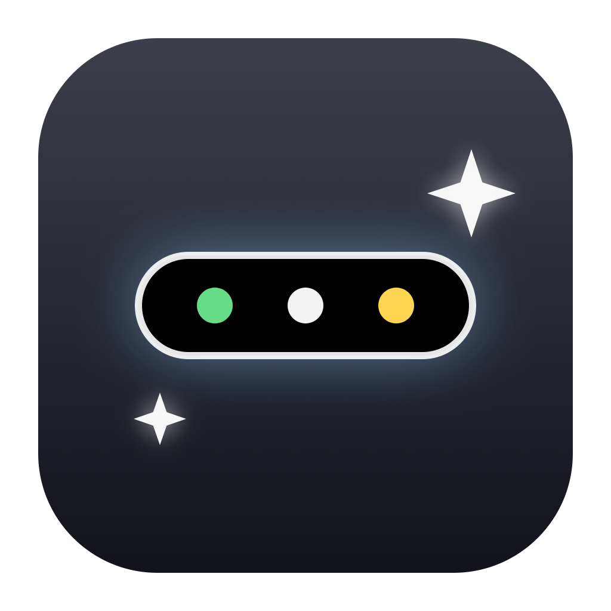
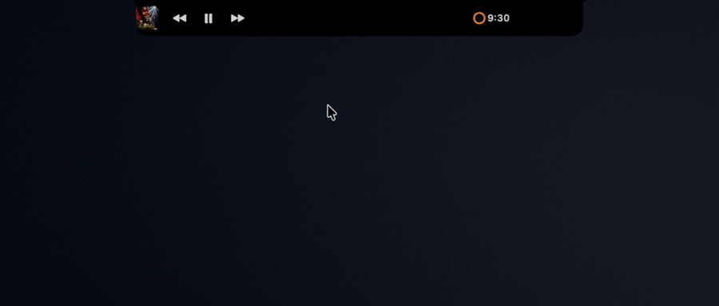
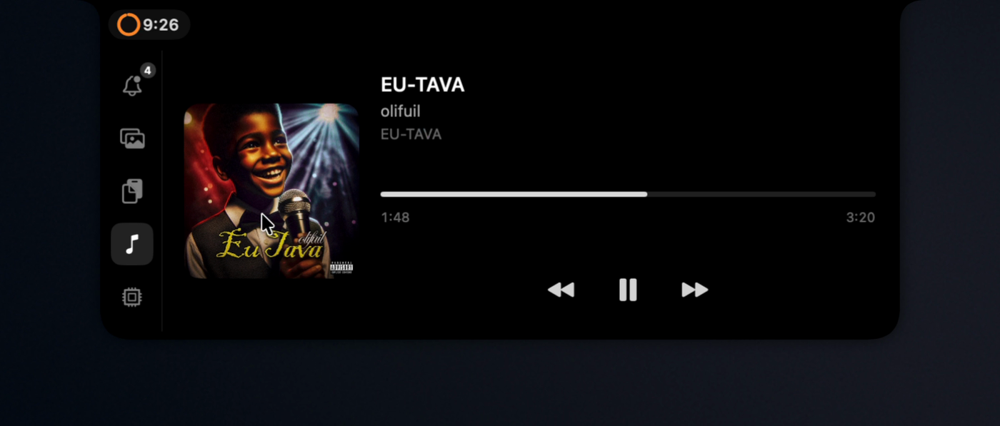

<p align="center">
  
</p>

<h1 align="center">PersonalIsland</h1>

<p align="center">
  A Dynamic Island for the MacBook notch — with a real-time <b>AI agent monitor</b>
  for Claude Code and Codex.
</p>

<p align="center">
  
  <br/><sub>Rest the pointer on the notch and the island unfolds. Leave, and it folds back.</sub>
</p>

Rest your pointer on the notch and a black island unfolds — a modular workspace
that stays out of your way and never steals keyboard focus from the app you're
typing in.

<p align="center">
  
  <br/><sub>Compact mode: artwork and transport controls hug the left edge, a running
  Clock timer and the agent count sit right behind the notch.</sub>
</p>

## Modules

| | Module | What it does |
|---|--------|--------------|
| 🤖 | **AI Agents** | Live cards for every Claude Code and Codex session: state (working / needs permission / finished / failed), current activity, cycle duration. Codex Desktop is monitored even though it ignores hooks — via a read-only local session stream. |
| 🔔 | **Attention** | A unified inbox of the moments you'd otherwise miss: an agent needs permission, finished, or failed. Deduplicated, persisted, one native notification per event — never two. |
| 📸 | **Screenshot Buffer** | Every screenshot and copied image lands in a buffer with Finder-style multi-item drag-out. Originals are never deleted. |
| 📋 | **Clipboard** | In-memory history of what you copy — text, links, code, files — with pinning and type filters. Password-manager entries are never captured. |
| 🎵 | **Now Playing** | Global media card with artwork and transport controls, including browser tabs (Arc) when macOS won't expose the session. |
| ⏱ | **Timer** | The macOS Clock timer, without a tab of its own: a ring and countdown in the compact bar, a capsule in the expanded view that opens Clock. Nothing at all when no timer runs. |

<p align="center">
  
  <br/><sub>Expanded: the sidebar switches modules, the timer keeps its place in the notch strip.</sub>
</p>

## Highlights

- **Hover to open, leave to close** — with an intent delay so a passing cursor
  doesn't trigger it. Click works too. Delays are tunable in Settings.
- **Never becomes the key window.** Your keyboard focus stays where you work.
- **English + Русский**, switchable live from the menu bar — UI, tooltips and
  notifications included.
- **Settings**: hover behavior, per-kind and per-provider agent notifications,
  launch at login, buffer sizes, retention, sidebar module order.
- **The Clock timer rides along** — a ring and countdown in the bar, no extra tab.
- Auto-updates via Sparkle.

## Install

[**Download PersonalIsland 1.1.0**](https://github.com/linkoln-1/mac-dynamic-island/releases/latest)
— open the DMG, drag PersonalIsland to Applications, launch. It is Developer ID
signed and notarized by Apple, so it opens with a normal double click, and it
updates itself through Sparkle.

Requirements: **macOS 15 or later**, on a **MacBook with a notch** — the island
is drawn around the notch, so that is where it lives. The app is distributed
outside the App Store because it relies on private APIs the sandbox forbids.

## Build from source

```bash
brew install xcodegen
git clone https://github.com/linkoln-1/mac-dynamic-island
cd mac-dynamic-island
xcodegen
xcodebuild -project PersonalIsland.xcodeproj -scheme PersonalIsland \
  -configuration Debug build
```

Tests: `xcodebuild -project PersonalIsland.xcodeproj -scheme PersonalIsland test`
(237 unit and interaction tests).

## How the agent monitor works

Claude Code sessions are observed through its official hook system: a tiny
helper normalizes lifecycle events and hands them to the app over a unix
socket, with an on-disk spool as the fallback. Codex Desktop's bundled runtime
doesn't execute hooks, so PersonalIsland tails its local rollout stream
(read-only, metadata only — prompts and outputs are never read). Everything
funnels into one state machine, one attention pipeline, one notification.
Details live in [`docs/`](docs/): the spec, field-verified research notes and
the attention/localization architecture.

## License

MIT — see [LICENSE](LICENSE).

`Vendor/MediaRemoteAdapter` is from
[ungive/mediaremote-adapter](https://github.com/ungive/mediaremote-adapter),
BSD-3-Clause (© Jonas van den Berg) — see its bundled LICENSE.
